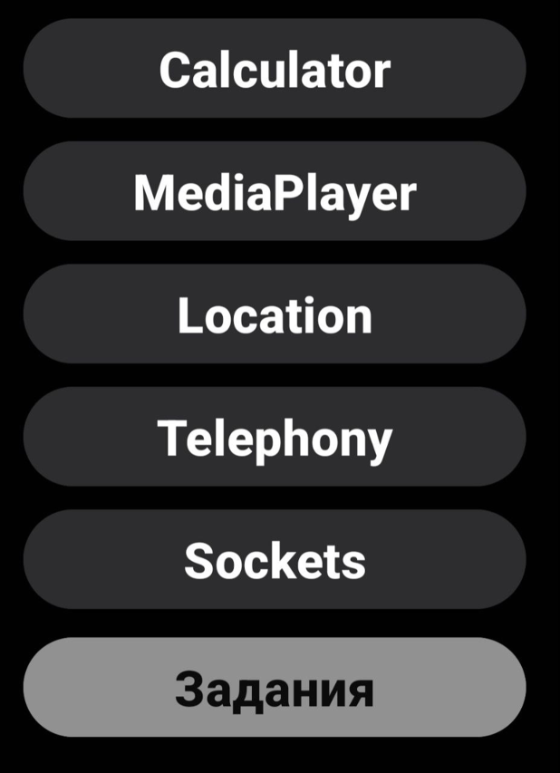

# Демин Сергей Алексеевич ИКС-433
## Визуальное программирование и человеко-машинное взаимодействие

## Практическая работа №4.5 "Рефакторинг. Разделение по Activities."

### Цель
1. Из MainActivity необходимо создать некий hub, в котором будут отображаться кнопки перехода на другие Activity;✅
2. Функционал калькулятора из ПР4 перенести на новое (необходимо создать) новое Activity;✅
3. Реализовать метод перехода из MainActivity в другие при помощи кнопок.✅

### Дизайн

## Практическая работа №4 ”Калькулятор"

### Цель
Основной целью данного проекта является написание простого калькулятора на языке программирования Kotlin, который должен соответствовать следующим критериям:
1. Калькулятор должен состояить из кнопок циферблата (от 0 до 9)✅ 
2. Должен включать в состав Layout кнопки “действий” ( + , -, *, /, =)✅
3. Должен включать в состав TextView для отображения результата нажатия на Button’s из пунктов 1 и 2✅
4. При нажатии на = необходимо обработать строку из TextView вручную и выполнить записанные в строку операции✅
5. Достаточно обработки одной операции, нет необходимости обработки нескольких операций✅
6. Результат отправить на Github (или аналоги) репозиторий✅
7. Android-проект будет основным в ветке main\master✅
8. Заменить весь Ваш проект файлами Android-studio, оставив директорию с исходным кодом✅

### Логика работы
1. Пользователь вводит первое число
2. Выбирает оператор
3. Вводит второе число
4. Нажимает "=" для получения результата
5. Результат становится новым первым числом для следующих операций

### Обработка особых случаев
- Защита от множественных десятичных точек
- Корректная обработка отрицательных чисел
- Автоматическое преобразование целых чисел (удаление .0)

### Дизайн (немного похож на встроенный калькулятор Samsung OneUI)

### Технические детали
Язык: Kotlin

Минимальная версия Android: **11**
